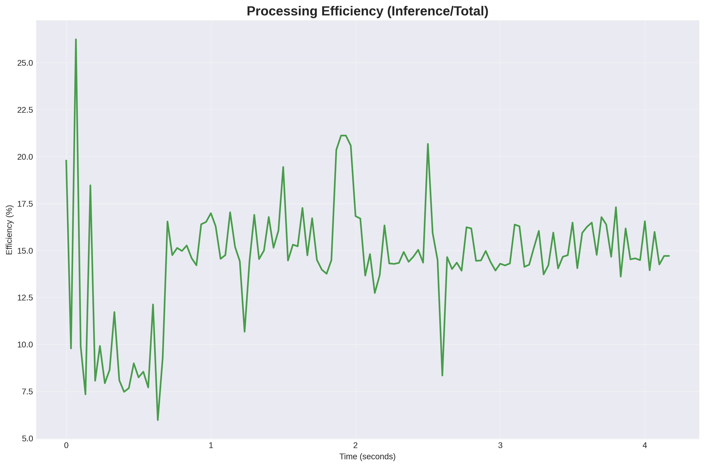
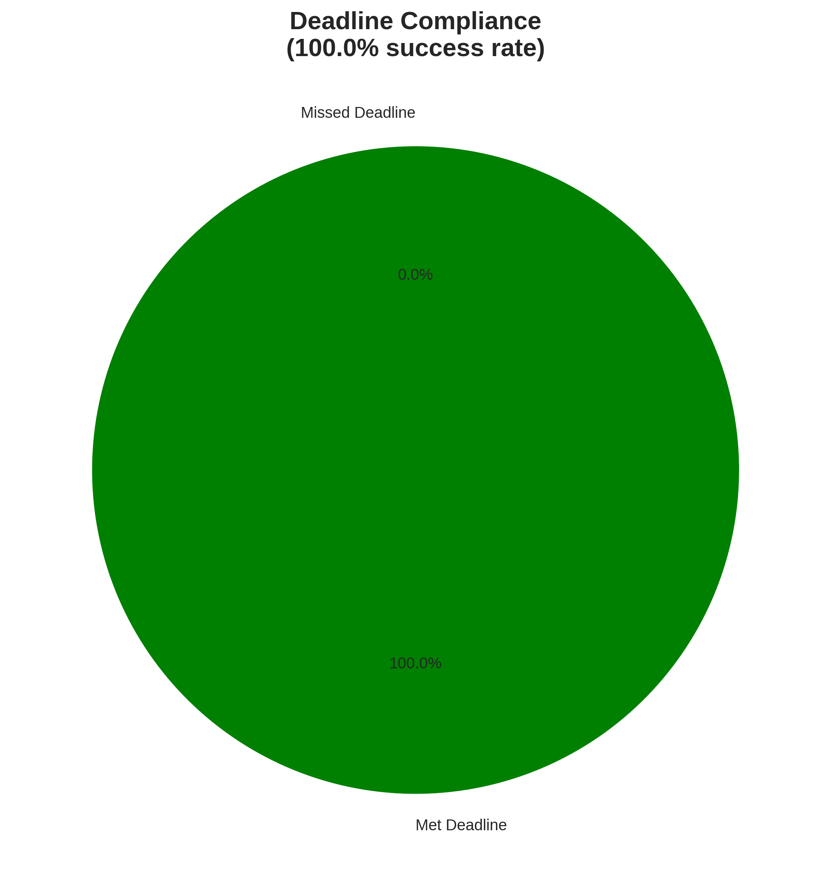
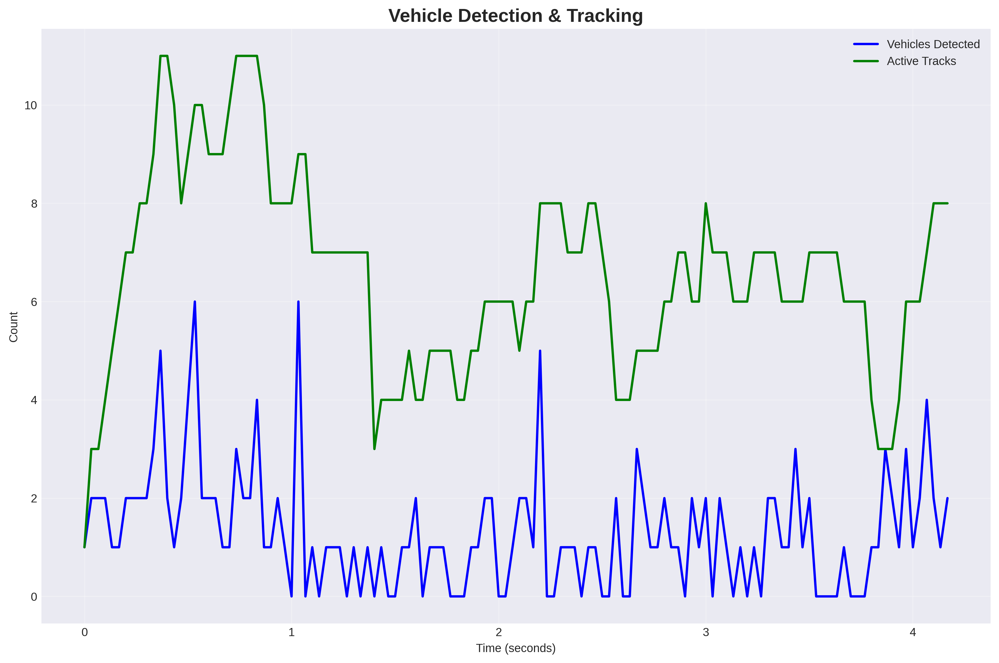

# Perception-RT

A high-performance real-time video processing system designed for intelligent vehicle analytics and computer vision applications. Built with CUDA acceleration, TensorRT optimization, and comprehensive performance monitoring.

## Key Features

### Real-Time Performance
- **Sub-3ms Latency**: Average end-to-end processing latency of 2.07ms with 95th percentile at 3.11ms
- **100% Deadline Compliance**: Maintains 24 FPS 4K target with zero missed deadlines
- **CUDA Acceleration**: GPU-optimized motion detection and preprocessing pipelines
- **TensorRT Integration**: Optimized FP16 inference with dynamic batching support

### Computer Vision Capabilities
- **YOLOv11 Object Detection**: Real-time vehicle detection with 10+ objects per frame
- **Multi-Object Tracking**: Persistent vehicle tracking with trajectory analysis
- **Optical Flow Analysis**: Lucas-Kanade sparse optical flow for motion estimation

### Vehicle Analytics
- **Collision Warning System**: Real-time proximity detection and safety zone monitoring
- **Traffic Density Analysis**: Automated vehicle counting and density metrics
- **Safety Zone Monitoring**: Configurable danger zones with real-time alerts

### Production-Ready Architecture
- **Modular Pipeline**: Decoupled processing stages with configurable feature toggles
- **Comprehensive Monitoring**: Real-time performance metrics and telemetry
- **Memory Management**: Efficient buffering with configurable memory limits
- **Configuration-Driven**: YAML-based configuration for deployment flexibility

## Performance Metrics

The system demonstrates exceptional efficiency with inference operations comprising only 14.9% of total processing time, leaving substantial headroom for additional features and higher resolution inputs.

Consistent 100% deadline compliance ensures reliable real-time operation essential for safety-critical applications.

Advanced vehicle analytics with multi-object tracking, detecting an average of 1.3 vehicles per frame with up to 6 simultaneous tracked objects.

## Technical Architecture

### Core Components
- **Pipeline Controller**: Adaptive quality control with hysteresis-based switching
- **ML Engine**: TensorRT-accelerated inference with OpenCV DNN fallback
- **GPU Motion Detector**: CUDA kernels for background subtraction and frame differencing
- **Vehicle Analytics Engine**: Specialized module for automotive applications
- **Output Manager**: Comprehensive logging, video output, and performance monitoring

### Dependencies
- **CUDA Toolkit**
- **TensorRT**
- **OpenCV 4.5+**
- **YOLOv11**
- **C++20**
